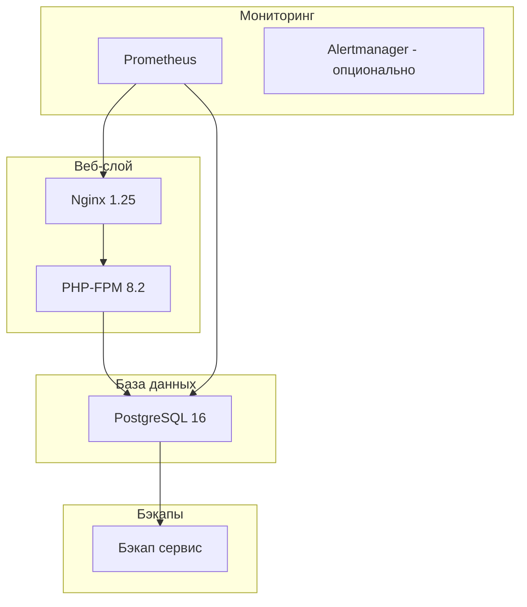

# Runbook для операторов Flibusta

Это руководство для операторов, которые поддерживают и управляют системой Flibusta в производственной среде.

## Оглавление

1. [Структура системы](#структура-системы)
2. [Ежедневные операции](#ежедневные-операции)
3. [Обновление данных](#обновление-данных)
4. [Мониторинг и алерты](#мониторинг-и-алерты)
5. [Резервное копирование](#резервное-копирование)
6. [Восстановление после сбоя](#восстановление-после-сбоя)
7. [Производительность базы данных](#производительность-базы-данных)
8. [Инциденты и решения проблем](#инциденты-и-решения-проблем)

---

## Структура системы

### Компоненты



### Директории

- `/application` - Основное приложение
- `/application/tools` - Скрипты утилит (backup.sh, monitoring.sh, alerting.sh)
- `/application/cache` - Кэш (authors, covers, opds, tmp)
- `/backup` - Бэкапы БД и конфигурации
- `/configs/prometheus` - Конфигурация Prometheus

---

## Ежедневные операции

### Чек-лист ежедневных проверок

- [ ] Проверить здоровье контейнеров: `docker-compose ps`
- [ ] Проверить логи ошибок: `docker-compose logs --tail=100`
- [ ] Проверить использование диска: `df -h /application`
- [ ] Проверить использование памяти контейнерами: `docker stats`
- [ ] Проверить свободное место в БД: `docker-compose exec postgres psql -U flibusta -d flibusta -c "SELECT pg_size_pretty(pg_database_size('flibusta'));"`

### Проверка веб-интерфейса

1. Открыть http://localhost:27100/service/
2. Проверить статистику:
   - Количество книг
   - Размер архива
   - Размер кэша
3. Проверить статус импорта (если активен)

### Проверка OPDS API

```bash
# Проверить главную страницу OPDS
curl -I http://localhost:27100/opds/

# Проверить список книг
curl http://localhost:27100/opds/list/

# Проверить поиск
curl "http://localhost:27100/opds/search?q=тест"
```

---

## Обновление данных

### 1. Скачивание SQL файлов с Флибусты

```bash
# Запуск скрипта скачивания
cd /путь/к/flibusta
chmod +x getsql.sh
./getsql.sh
```

### 2. Скачивание обложек

```bash
# Запуск скрипта скачивания обложек
chmod +x getcovers.sh
./getcovers.sh
```

### 3. Ежедневные обновления книг

```bash
# Автоматическое скачивание ежедневных обновлений
chmod +x update_daily.sh
./update_daily.sh
```

### 4. Импорт в базу данных

**Через веб-интерфейс:**

1. Открыть http://localhost:27100/service/
2. Нажать кнопку "Обновить базу"
3. Дождаться завершения (10-60 минут в зависимости от объема данных)
4. Проверить статус в разделе логов

**Через командную строку:**

```bash
# Запуск импорта SQL файлов
docker-compose exec php-fpm sh /application/tools/app_import_sql.sh

# Мониторинг процесса
docker-compose logs -f php-fpm

# Проверка файла статуса
docker-compose exec php-fpm cat /application/cache/sql_status
```

### 5. Индексация ZIP архивов

```bash
# Запуск реиндексации ZIP файлов
docker-compose exec php-fpm sh /application/tools/app_reindex.sh

# Или через PHP напрямую
docker-compose exec php-fpm php /application/tools/app_update_zip_list.php
```

**Ожидаемое время индексации:**
- 1000 файлов: ~1-2 минуты
- 5000 файлов: ~5-10 минут
- 10000 файлов: ~20-30 минут

---

## Мониторинг и алерты

### Запуск Prometheus

```bash
# Запуск контейнера мониторинга
docker-compose up -d monitoring

# Проверка Prometheus UI
http://localhost:9090
```

### Проверка метрик

```bash
# Запуск скрипта мониторинга (получить метрики в JSON)
docker-compose exec php-fpm sh /application/tools/monitoring.sh

# Пример вывода:
# {
#   "timestamp": "2025-01-15T10:30:00Z",
#   "metrics": {
#     "postgres": {
#       "is_connected": "true",
#       "total_books": "123456",
#       ...
#     }
#   }
# }
```

### Запуск алертов

```bash
# Запуск проверок здоровья
docker-compose exec php-fpm sh /application/tools/alerting.sh

# Сценарии алертов:
# - Критический: Диск заполнен на >80%
# - Критический: Память использована >90%
# - Критический: Нагрузка системы >5.0
# - Критический: Слишком много соединений PostgreSQL (>10)
# - Критический: Процесс импорта завис (>30 минут)
```

### Настройка алертов через email

1. Установить sendmail или настроить SMTP
2. Раскомментировать строки отправки email в `alerting.sh`
3. Настроить переменную окружения `FLIBUSTA_ALERT_EMAIL`

```bash
# Добавить в .env
FLIBUSTA_ALERT_EMAIL=admin@yourdomain.com
```

---

## Резервное копирование

### Создание бэкапа вручную

```bash
# Запуск контейнера бэкапа
docker-compose up -d backup

# Проверить результаты в /backup/
ls -lh /backup/postgres/
ls -lh /backup/config/
```

### Автоматические бэкапы (через cron)

```bash
# Добавить в crontab оператора
crontab -e

# Ежедневный бэкап в 2:00 ночи
0 2 * * * cd /путь/к/flibusta && docker-compose run --rm backup > /backup/cron_backup.log 2>&1

# Еженедельный бэкап в воскресенье в 3:00 ночи
0 3 * * 0 cd /путь/к/flibusta && docker-compose run --rm backup > /backup/weekly_backup.log 2>&1
```

### Проверка бэкапов

```bash
# Проверить последние бэкапы
ls -lht /backup/postgres/ | head -5

# Проверить целостность бэкапа (контрольные суммы)
cat /backup/postgres/flibusta_full_*.md5

# Тестовое восстановление (опционально, требует много места)
docker-compose exec -T backup bash -c '
    export FLIBUSTA_TEST_RESTORE=true
    sh /application/tools/backup.sh
'
```

---

## Восстановление после сбоя

### Сценарий 1: Падение PostgreSQL

```bash
# 1. Проверить логи
docker-compose logs postgres --tail=100

# 2. Перезапустить контейнер
docker-compose restart postgres

# 3. Проверить восстановление
docker-compose ps postgres

# 4. Если не запускается, проверить вольюм
docker volume ls | grep db-data
```

### Сценарий 2: Заполнение диска

```bash
# 1. Проверить использование диска
df -h /application
du -sh /backup/*
du -sh /application/cache/*

# 2. Очистить старые бэкапы (оставить последние 7 дней)
find /backup -name "*.sql.gz" -mtime +7 -delete

# 3. Очистить кэш
docker-compose exec php-fpm sh -c "
    rm -rf /application/cache/tmp/*
    find /application/cache/authors/ -mtime +30 -delete
    find /application/cache/covers/ -mtime +30 -delete
"

# 4. Очистить логи Docker
docker system prune -f
```

### Сценарий 3: Повреждение базы данных

```bash
# 1. Восстановить из последнего бэкапа
gunzip -c /backup/postgres/flibusta_full_LATEST.sql.gz | \
    docker-compose exec -T postgres psql -U flibusta -d flibusta

# 2. Проверить целостность
docker-compose exec postgres psql -U flibusta -d flibusta \
    -c "SELECT COUNT(*) FROM libbook WHERE deleted='0'"

# 3. Переиндексировать ZIP файлы
docker-compose exec php-fpm sh /application/tools/app_reindex.sh

# 4. Обновить полнотекстовые индексы
docker-compose exec postgres psql -U flibusta -d flibusta \
    -f /application/tools/update_vectors.sql
```

### Сценарий 4: Полное восстановление на новый сервер

```bash
# 1. Скопировать конфигурацию
cp /path/to/flibusta/.env /new/server/path/.env
cp -r /path/to/flibusta/secrets /new/server/path/secrets

# 2. Скопировать бэкап БД
scp /backup/postgres/flibusta_full_LATEST.sql.gz new-server:/tmp/

# 3. На новом сервере
cd /path/to/flibusta
docker-compose up -d postgres
sleep 10

# 4. Восстановить базу
gunzip -c /tmp/flibusta_full_LATEST.sql.gz | \
    docker-compose exec -T postgres psql -U flibusta -d flibusta

# 5. Скопировать ZIP архивы книг (если на отдельном диске)
rsync -avz --progress /old/server/Flibusta.Net/ \
    /new/server/Flibusta.Net/

# 6. Индексация ZIP файлов
docker-compose up -d php-fpm webserver
docker-compose exec php-fpm sh /application/tools/app_reindex.sh
```

---

## Производительность базы данных

### Проверка медленных запросов

```bash
# Включить pg_stat_statements
docker-compose exec postgres psql -U flibusta -d flibusta \
    -c "CREATE EXTENSION IF NOT EXISTS pg_stat_statements;"

# Найти TOP медленные запросы
docker-compose exec postgres psql -U flibusta -d flibusta -c "
SELECT 
    query,
    calls,
    total_exec_time,
    mean_exec_time,
    max_exec_time,
    stddev_exec_time
FROM pg_stat_statements
ORDER BY mean_exec_time DESC
LIMIT 10;
"
```

### Оптимизация через VACUUM

```bash
# Ручной VACUUM для большой таблицы libbook
docker-compose exec postgres psql -U flibusta -d flibusta \
    -c "VACUUM FULL ANALYZE VERBOSE libbook;"

# VACUUM только для индексов
docker-compose exec postgres psql -U flibusta -d flibusta \
    -c "VACUUM ANALYZE libbook;"

# Проверить состояние VACUUM
docker-compose exec postgres psql -U flibusta -d flibusta -c "
SELECT schemaname, tablename, autovacuum_count, last_autovacuum, autovacuum_count
FROM pg_stat_user_tables
WHERE schemaname = 'public'
ORDER BY autovacuum_count DESC;
"
```

### Проверка индексов

```bash
# Проверить размер индексов
docker-compose exec postgres psql -U flibusta -d flibusta -c "
SELECT 
    schemaname,
    tablename,
    indexname,
    pg_size_pretty(pg_relation_size(indexrelid)) as size
FROM pg_stat_user_indexes
WHERE schemaname = 'public'
ORDER BY pg_relation_size(indexrelid) DESC
LIMIT 20;
"

# Проверить использование индексов (seq scans)
docker-compose exec postgres psql -U flibusta -d flibusta -c "
SELECT 
    schemaname,
    tablename,
    indexname,
    idx_scan,
    idx_tup_read,
    idx_tup_fetch
FROM pg_stat_user_indexes
WHERE idx_scan = 0 AND idx_tup_read > 1000
ORDER BY idx_tup_read DESC;
"
```

### Обновление статистики

```bash
# Полное обновление статистики (занимает время)
docker-compose exec postgres psql -U flibusta -d flibusta \
    -c "ANALYZE VERBOSE;"

# Только для больших таблиц
docker-compose exec postgres psql -U flibusta -d flibusta \
    -c "ANALYZE libbook; ANALYZE libavtor; ANALYZE libavtorname;"
```

---

## Инциденты и решения проблем

### Проблема 1: Медленное сканирование ZIP файлов

**Симптомы:** Реиндексация занимает более 30 минут для 1000 файлов

**Диагностика:**
```bash
# Проверить скорость файловой системы
dd if=/dev/zero of=testfile bs=1M count=100 oflag=direct

# Проверить I/O (Ubuntu)
iostat -x 1 5
```

**Решения:**
1. Переместить ZIP файлы на SSD
2. Использовать отдельный диск для базы данных
3. Увеличить `maintenance_work_mem` в `postgresql_custom.conf`

### Проблема 2: Высокое использование памяти PostgreSQL

**Симптомы:** Контейнер postgres занимает >4GB памяти

**Диагностика:**
```bash
# Проверить использование памяти контейнером
docker stats postgres --no-stream

# Проверить подключенные процессы
docker-compose exec postgres psql -U flibusta -d flibusta \
    -c "SELECT count(*), state FROM pg_stat_activity GROUP BY state;"
```

**Решения:**
1. Снизить `shared_buffers` в `postgresql_custom.conf`
2. Снизить `max_connections`
3. Включить connection pooling (pgBouncer) при необходимости

### Проблема 3: Медленный OPDS API

**Симптомы:** Генерация OPDS фидов занимает >5 секунд

**Диагностика:**
```bash
# Проверить время генерации OPDS фида
time curl http://localhost:27100/opds/list > /dev/null

# Проверить кэш OPDS
docker-compose exec php-fpm ls -lh /application/cache/opds/
```

**Решения:**
1. Увеличить TTL кэша (3600 → 7200 секунд)
2. Оптимизировать SQL запросы в OPDS фидах
3. Включить OPDS кэширование (уже должно быть включено)

### Проблема 4: Ошибки при открытии ZIP файлов

**Симптомы:** Книги не открываются, ошибки в логах: "ZIP файл не найден"

**Диагностика:**
```bash
# Проверить наличие книги в индексе
docker-compose exec postgres psql -U flibusta -d flibusta -c "
SELECT filename, start_id, end_id, is_valid 
FROM book_zip 
WHERE is_valid = FALSE;
"

# Проверить ZIP файл напрямую
ls -lh /application/flibusta/f.n-*.zip | head -5

# Открыть ZIP файл для проверки
docker-compose exec php-fpm php -r '
    $zip = new ZipArchive();
    $zip->open("/application/flibusta/f.n-100000-100100.zip");
    echo "Files: " . $zip->numFiles . "\n";
    for ($i = 0; $i < $zip->numFiles; $i++) {
        echo $zip->getNameIndex($i) . "\n";
    }
'
```

**Решения:**
1. Запустить полную реиндексацию: `docker-compose exec php-fpm sh /application/tools/app_reindex.sh`
2. Проверить целостность ZIP файлов
3. Удалить недействительные файлы из индекса

### Проблема 5: Низкая скорость скачивания файлов

**Симптомы:** Скорость скачивания <1 MB/s

**Диагностика:**
```bash
# Проверить скорость через wget
wget -O /dev/null http://localhost:27100/usr.php?id=12345

# Проверить настройки PHP-FPM
docker-compose exec php-fpm cat /usr/local/etc/php-fpm.d/www.conf
```

**Решения:**
1. Увеличить `output_buffering` в php-fpm конфигурации
2. Использовать X-Accel-Redirect для статических файлов
3. Включить sendfile в nginx

---

## Полезные команды

### Быстрая проверка статуса

```bash
# Комплексная проверка статуса
docker-compose ps
docker stats --no-stream
df -h /application
docker-compose exec php-fpm sh -c "df -h /application/cache"
docker-compose exec php-fpm sh -c "du -sh /application/flibusta | head -1"
```

### Сброс кэша

```bash
# Очистка кэша через веб-интерфейс
# Откройте http://localhost:27100/service/ и нажмите "Очистить кэш"

# Очистка через командную строку
docker-compose exec php-fpm sh -c "
    rm -rf /application/cache/tmp/*
    rm -rf /application/cache/opds/*
    rm -rf /application/cache/authors/*
    rm -rf /application/cache/covers/*
"
```

### Просмотр логов

```bash
# Все логи
docker-compose logs

# Логи конкретного сервиса
docker-compose logs php-fpm --tail=100
docker-compose logs postgres --tail=100
docker-compose logs webserver --tail=100

# Логи с follow
docker-compose logs -f php-fpm

# Поиск ошибок в логах
docker-compose logs php-fpm | grep -i "error\|fatal\|exception"
```

### Перезапуск сервисов

```bash
# Перезапуск всех сервисов
docker-compose restart

# Перезапуск конкретного сервиса
docker-compose restart php-fpm

# Graceful reload nginx (без разрыва соединений)
docker-compose exec webserver nginx -s reload
```

---

## Контакты для инцидентов

| Роль | Имя | Email/Телефон |
|------|-----|---------------|
| Главный администратор | - | - |
| Разработчик | - | - |
| Системный администратор | - | - |

---

## Версия системы

- Версия: Flibusta Production
- Дата: 2025-01-15
- PostgreSQL: 16
- PHP: 8.2
- Nginx: 1.25
- Docker Compose: v2.x
